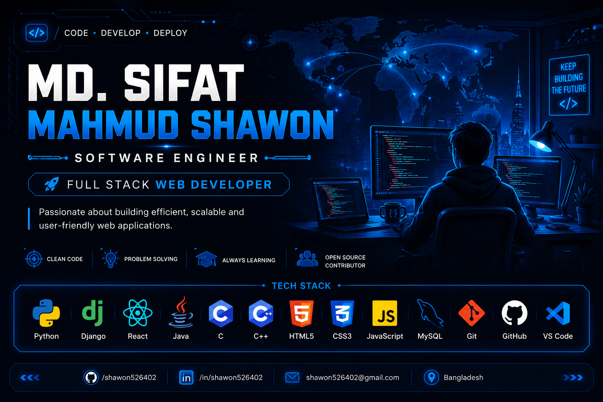

<p align="center">
  
</p>

<h1 align="center">Hi 👋, I'm Md. Sifat Mahmud Shawon</h1>

<h3 align="center">
💻 Software Engineer | 🌐 Full-Stack Web Developer | 🐍 Python & Django Developer
</h3>

<p align="center">

</p>

<p align="center">
<a href="mailto:Sifat.mahmud.hunter@gmail.com">

</a>

<a href="https://linkedin.com/in/sifat-mahmud-shawon-526173323">

</a>

<a href="https://github.com/shawon526402">

</a>

</p>

<p align="center">

</p>

---

# 👨‍💻 About Me


I'm **Md. Sifat Mahmud Shawon**, a passionate **Software Engineer** and **Full-Stack Web Developer** from **Bangladesh**.

🎓 B.Sc. in Computer Science & Engineering

🏫 Daffodil International University

I love building modern software, scalable web applications, and solving real-world problems through clean, maintainable code.

## 🚀 Current Focus

- 🌐 Full Stack Web Development
- 🐍 Django Development
- ⚛️ React Development
- 💻 Software Engineering
- ☁ REST API Development
- 📚 Data Structures & Algorithms
- 🚀 Open Source Contribution

---

# ⚡ Tech Stack

### 👨‍💻 Programming Languages

<p>


</p>

### 🌐 Frontend

<p>


</p>

### ⚙ Backend

<p>


</p>

### 🗄 Database

<p>


</p>

### 🛠 Tools

<p>


</p>

---

# 📊 GitHub Analytics

<p align="center">


</p>

<p align="center">


</p>

---
# 🏆 GitHub Trophies

<p align="center">

</p>

---

# 📈 Contribution Graph

<p align="center">

</p>

---

# 💼 Professional Skills

<table>
<tr>
<td>

### 🌐 Web Development

- Full-Stack Web Development
- Responsive Web Design
- REST API Development
- Modern UI Development

</td>

<td>

### 💻 Software Development

- Object-Oriented Programming
- Problem Solving
- Clean Code
- Database Design

</td>
</tr>

<tr>
<td>

### 🚀 Backend

- Python
- Django
- MySQL
- Authentication
- CRUD Applications

</td>

<td>

### ⚛ Frontend

- HTML5
- CSS3
- JavaScript
- Bootstrap
- React

</td>
</tr>
</table>

---

# 🎯 Currently Learning

```text
✔ Advanced Django

✔ React Ecosystem

✔ REST API Development

✔ Software Design Patterns

✔ Data Structures & Algorithms

✔ System Design

✔ Git & GitHub Best Practices
```

---

# 📂 Featured Projects

🚧 Currently Building My Portfolio...

Upcoming Professional Projects:

⭐ Student Management System

⭐ E-Commerce Website

⭐ Hospital Management System

⭐ Portfolio Website

⭐ React Dashboard

⭐ Django Blog

⭐ Library Management System

⭐ Expense Tracker

⭐ REST API Project

⭐ Python Automation Scripts

---

# 📌 Development Goals

🎯 Become a Professional Software Engineer

🎯 Build Real-World Full-Stack Applications

🎯 Contribute to Open Source

🎯 Learn Cloud Technologies

🎯 Master Software Architecture

🎯 Explore Artificial Intelligence

---

# 📚 Currently Working On

- 💻 Building Real Projects
- 🌐 Improving Full-Stack Skills
- ⚛ Learning React
- 🐍 Advanced Django
- 🚀 GitHub Portfolio Development

---
# 🐍 Contribution Snake

> ⚠️ Enable GitHub Actions first, then replace `YOUR_USERNAME` with `shawon526402`.

<p align="center">
  
</p>

---

# 🌟 Developer Highlights

- 💻 Passionate Software Developer
- 🌐 Full-Stack Web Developer
- 🐍 Python & Django Developer
- ⚛️ React Enthusiast
- ☁️ REST API Developer
- 📚 Lifelong Learner
- 🚀 Open Source Enthusiast

---

# 📫 Connect With Me

<p align="center">

<a href="mailto:Sifat.mahmud.hunter@gmail.com">

</a>

<a href="https://linkedin.com/in/sifat-mahmud-shawon-526173323">

</a>

<a href="https://github.com/shawon526402">

</a>

</p>

---

# 📜 Certifications

🚀 Coming Soon...

- Python
- Django
- React
- Java
- Git & GitHub
- Problem Solving

---

# 💡 Developer Philosophy

> **"First, solve the problem. Then, write the code."** — John Johnson

---

# 👀 Profile Views

<p align="center">

</p>

---

# 🤝 Let's Collaborate

I'm always interested in collaborating on:

- 🌐 Full-Stack Web Applications
- 🐍 Python & Django Projects
- ⚛️ React Applications
- 💻 Software Development
- 🚀 Open Source Projects

Feel free to connect with me!

---

<h3 align="center">
⭐ Thank you for visiting my profile! ⭐
</h3>

<p align="center">
<i>Code • Learn • Build • Improve • Repeat 🚀</i>
</p>
